# Caso de Estudio: PSICOLAU — Psicología y Resiliencia

## El Reto
Laura (Ana Laura Gómez Díaz, psicóloga clínica) tenía un currículum extenso — maestrías, protocolos clínicos propios, publicaciones, apariciones en medios nacionales — pero ninguna presencia web que lo comunicara. El reto no era falta de contenido, era organizarlo sin abrumar a alguien buscando ayuda psicológica.

## Línea de tiempo del proyecto
- **Planeación inicial**: Estructuración del proyecto, creación del repositorio y layout base (`index.html`, etc.).
- **Correcciones de codificación**: Resolución de problemas complejos con caracteres UTF-8 en archivos HTML (guiones, tildes) para asegurar correcta visualización.
- **Configuración SEO y Despliegue**: Inclusión de `sitemap.xml`, `robots.txt` y documentación inicial, conectando el repositorio directamente con Cloudflare Pages.
- **Ajustes de interfaz (UI/UX)**: Refinamiento de la responsividad con Flexbox para evitar distorsiones en las tarjetas de contenido, y optimización visual (colores de botones en estado activo/hover, íconos de FontAwesome y márgenes).
- **Actualización y mantenimiento de contenido**: Expansión de las áreas de atención (reestructuradas a 5 principales) y adición continua de nuevas publicaciones, medios y herramientas clínicas.

## Decisiones Clave

- **Multipágina sobre una sola página (SPA)**: Con tanto contenido de autoridad, una sola página se sentiría interminable y perdería fuerza en SEO — cada área de atención y cada categoría de experiencia necesitaba su propia URL indexable para búsquedas orgánicas específicas.
- **HTML/CSS/JS vanilla sobre un framework**: Se evaluó utilizar herramientas como Next.js o React, pero se optó por un stack clásico (Vanilla JS/CSS) porque el sitio no requería un blog dinámico (CMS) desde el día uno, y mantenerlo sin un "build step" complejo ni dependencias externas lo hace sumamente sostenible a largo plazo y extremadamente veloz (tiempos de carga instantáneos en Cloudflare).
- **Paleta extraída del logo existente**: En vez de proponer una paleta de color completamente nueva que alienara la marca actual, se derivaron los tonos exactos de la mariposa del logo (Rosa `#EC5E86`, Turquesa `#3EB8CC`) para mantener coherencia de marca, complementándolos con grises cálidos para los textos, proyectando profesionalismo clínico y calidez sin caer en esquemas hospitalarios fríos. 
- **Dirección de un agente de IA (harness)**: En vez de darle al agente una sola instrucción vaga, se construyó un AGENTS.md como memoria persistente del proyecto — con las decisiones técnicas, la paleta de colores y reglas de verificación documentadas de antemano — para que cualquier sesión futura del agente mantuviera contexto sin repetir instrucciones. Esto incluyó una fase dedicada de auditoría de seguridad dirigida explícitamente por prompt antes del primer deploy, en vez de confiar en que el agente la considerara por iniciativa propia.

## Seguridad
Antes de publicar la primera versión de producción, se corrió una auditoría completa de seguridad, que incluyó:
- Exclusión total de la carpeta de recursos con datos personales mediante `.gitignore` para prevenir exposición en el repositorio.
- Inclusión de cabeceras de seguridad estrictas (CSP, X-Frame-Options) en el archivo `_headers` provisto para Cloudflare Pages.
- Uso del atributo `rel="noopener noreferrer"` en decenas de enlaces externos para evitar vulnerabilidades de *tabnabbing*.
- Implementación de Subresource Integrity (SRI) en las llamadas a CDNs (FontAwesome, fuentes).

## Resultado
Sitio de 5 páginas completamente responsivo, ultrarrápido y accesible, con formulario de contacto funcional vía Formspree, y flujo de despliegue continuo en Cloudflare Pages, listo para escalar o mantenerse pasivamente.

---

### Antes y Después

A continuación, la evolución visual desde el commit inicial (boceto base sin estilos finales) al estado final desplegado.

#### Estado Inicial (Work in Progress)

**Desktop**  
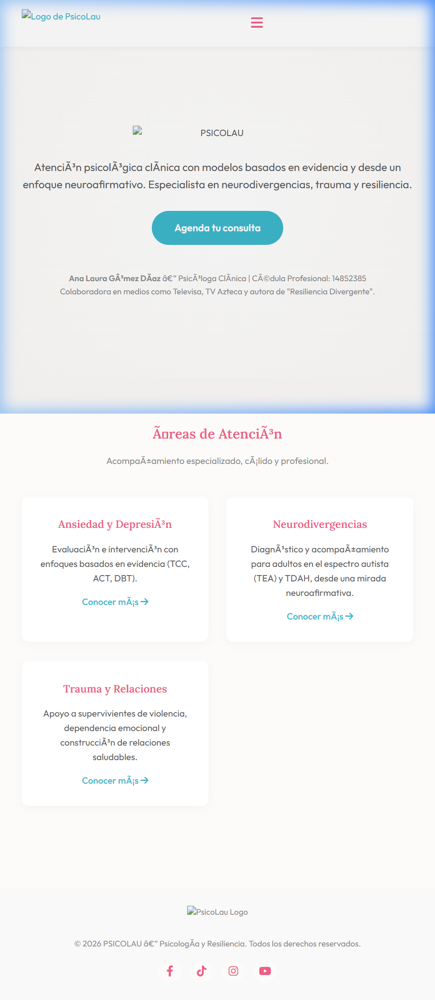

**Mobile**  
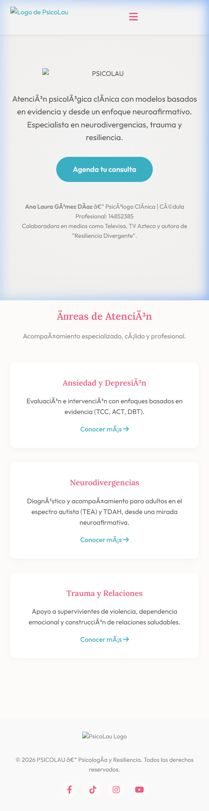

#### Versión Final

**Página de Inicio**  
*Desktop*  
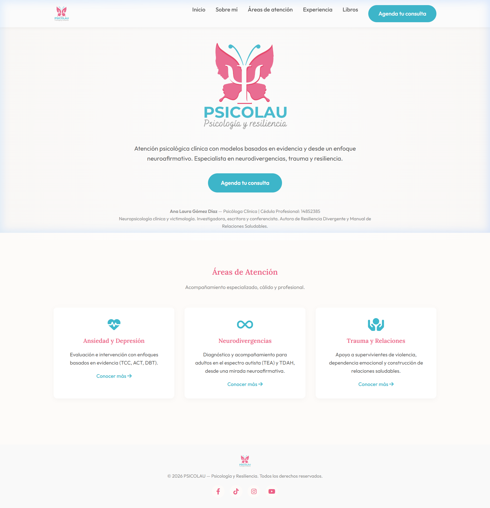  
*Mobile*  
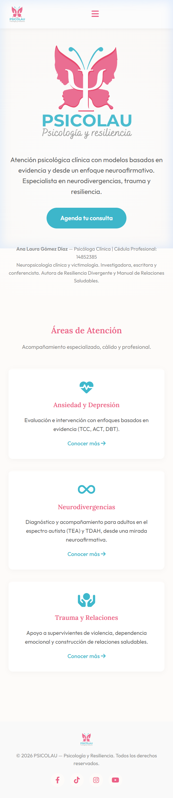  

**Sobre Mí**  
*Desktop*  
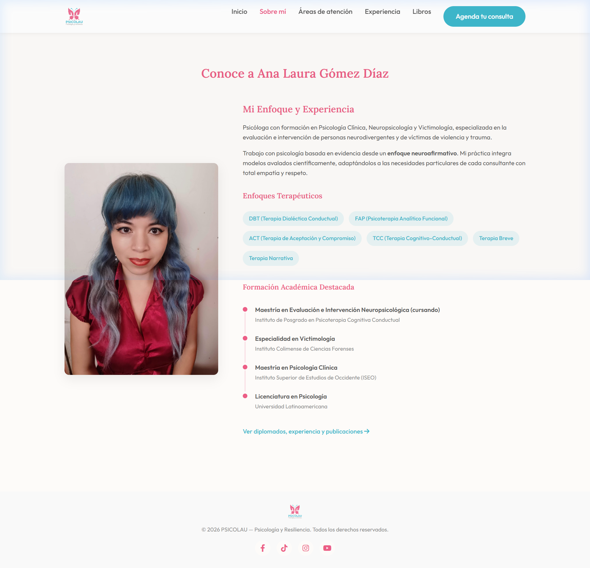  
*Mobile*  
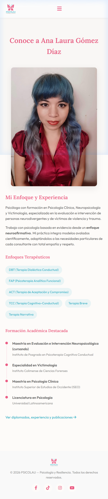  

**Áreas de Atención**  
*Desktop*  
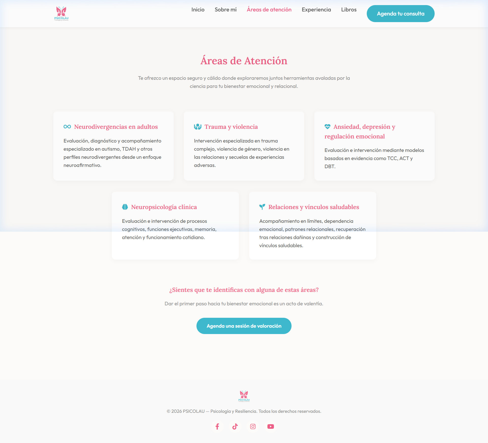  
*Mobile*  
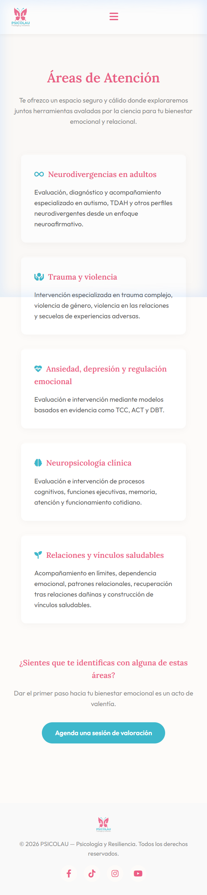  

**Experiencia y Divulgación**  
*Desktop*  
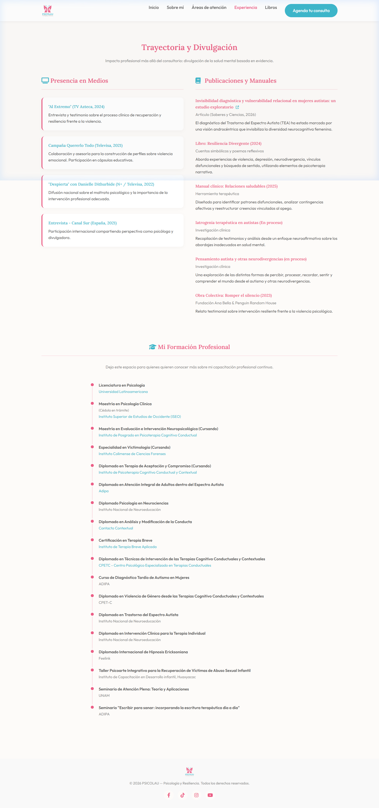  
*Mobile*  
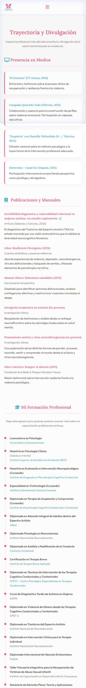  

**Contacto**  
*Desktop*  
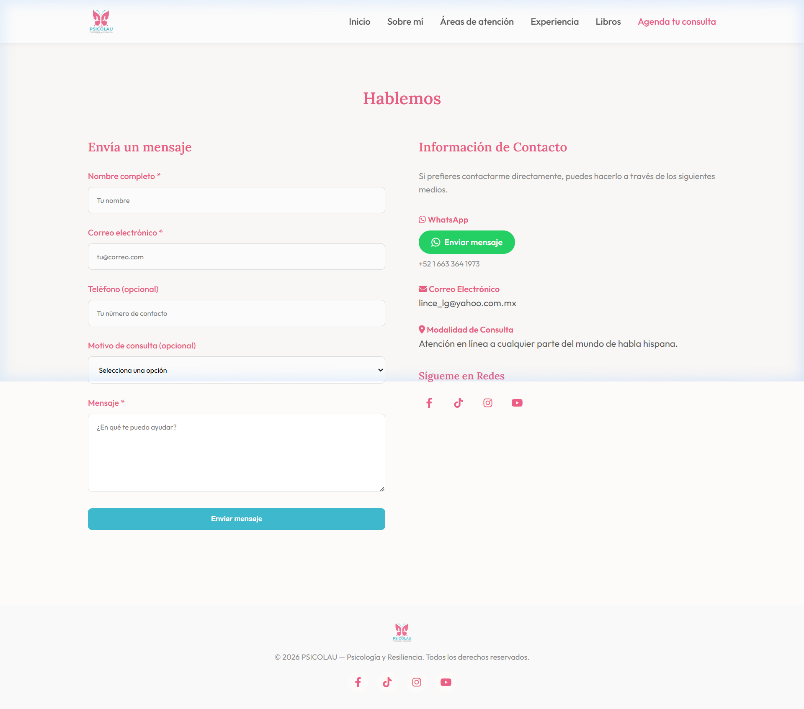  
*Mobile*  
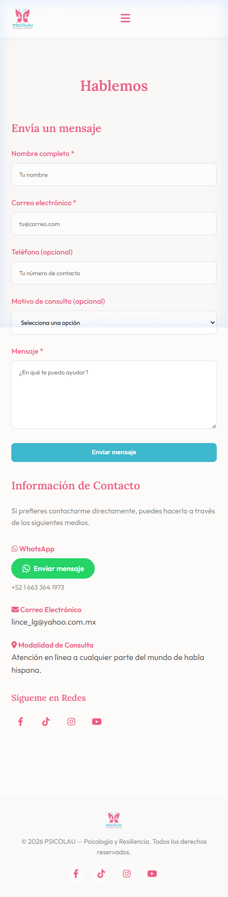
