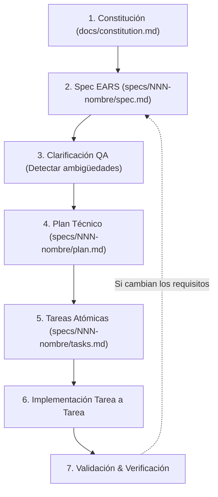

# Flujo de Trabajo: Spec-Driven Development (SDD)

Guía rápida y prompts para el desarrollo de funcionalidades guiadas por especificación con **Antigravity / Gemini**.

---

## 🔁 El Ciclo de Vida SDD

---

## 📑 Prompts por Fase

Usa estos prompts directamente en la conversación con el agente según la fase en la que te encuentres:

| Fase | Archivo resultante | Prompt sugerido |
|---|---|---|
| **1. Constitución** *(Solo al iniciar proyecto)* | `docs/constitution.md` | `"Proponme la constitución de este proyecto: principios cortos y verificables sobre stack, calidad, tests, seguridad y límites. Máx. 20 líneas. Espera mi aprobación."` |
| **2. Spec (Entrevista)** | `specs/00X-nombre/spec.md` | `"NO escribas código. Actúa como analista y hazme preguntas de una en una (máx. 6) sobre casos límite, errores y alcance para la funcionalidad [NOMBRE]. Luego genera specs/00X-nombre/spec.md con requisitos numerados en notación EARS, historias de usuario, fuera de alcance y criterios de finalización. Solo el QUÉ y el POR QUÉ."` |
| **3. Clarificación (QA)** | Feedback en chat / ajustes a `spec.md` | `"Revisa specs/00X-nombre/spec.md como un QA profesional: detecta ambigüedades, contradicciones, casos límite ausentes y conflictos con docs/constitution.md. Solo detecta huecos, no soluciones todavía."` |
| **4. Plan Técnico** | `specs/00X-nombre/plan.md` | `"Lee docs/constitution.md y specs/00X-nombre/spec.md. Sin escribir código aún: genera specs/00X-nombre/plan.md con módulos afectados, modelo de datos, diagramas y decisiones técnicas justificadas (incluyendo la alternativa descartada y por qué)."` |
| **5. Tareas Atómicas** | `specs/00X-nombre/tasks.md` | `"Genera specs/00X-nombre/tasks.md con tareas atómicas numeradas (T1, T2...), ordenadas por dependencia. Cada tarea debe incluir: Archivos a tocar, Qué hacer y 'Hecho cuando: [criterio verificable]'."` |
| **6. Implementación** | Código / Scripts | `"Implementa únicamente la tarea T1 de specs/00X-nombre/tasks.md. No avances a la siguiente hasta verificar que cumple su criterio de aceptación y no rompe nada existente."` |
| **7. Validación & Verificación** | Checklist de `AGENTS.md` | `"Ejecuta la lista de verificación obligatoria de AGENTS.md para validar que la tarea T1 está completa, sin regresiones y respetando la constitución."` |
| **Gestión del Cambio** | `spec.md` → `plan.md` → `tasks.md` | `"Queremos modificar el comportamiento de [X]. Actualiza primero specs/00X-nombre/spec.md y plan.md antes de tocar el código."` |

---

## 🎯 Notación EARS para Requisitos Funcionales

Cada requisito funcional de la `spec.md` debe estar escrito en uno de los 5 patrones EARS:

1. **Ubicuo (Comportamiento continuo):**
   > *`EL SISTEMA <comportamiento permanente>`*
2. **Evento (Disparado por una acción):**
   > *`CUANDO <evento / acción>, EL SISTEMA <respuesta esperada>`*
3. **Estado (Mientras se cumpla una condición):**
   > *`MIENTRAS <estado / modo activo>, EL SISTEMA <respuesta esperada>`*
4. **Excepción / Error (Comportamiento ante fallo):**
   > *`SI <condición no deseada / error>, ENTONCES EL SISTEMA <respuesta esperada>`*
5. **Opcional (Solo si una opción está habilitada):**
   > *`DONDE <característica opcional presente>, EL SISTEMA <respuesta esperada>`*

---

## 🛡️ Reglas de Oro

1. **La Spec describe el QUÉ y el POR QUÉ**: Prohibido hablar de nombres de archivos, SQL, frameworks o detalles de implementación en `spec.md`.
2. **El Plan describe el CÓMO**: Aquí vive la arquitectura, endpoints, esquemas Prisma y decisiones de diseño.
3. **Una tarea a la vez**: No implementar múltiples tareas en paralelo.
4. **Primero la Spec, luego el Código**: Ante cualquier cambio de opinión o nuevo requerimiento, se actualiza la especificación antes de cambiar el código.
