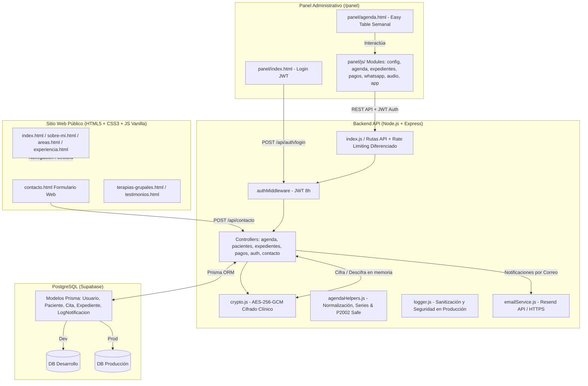

# Arquitectura Viva — PsicoLau

## Decisiones Técnicas Relevantes

- **Cifrado Simétrico AES-256-GCM en Aplicación (2026-08-26)**: Los 8 campos clínicos de notas de sesión se cifran en memoria con clave de 256 bits y tag de autenticación. Cero texto médico en claro en la DB.
- **Separación de Proyectos Supabase Dev / Prod (2026-08-25)**: Aislamiento total de base de datos para no comprometer citas reales durante pruebas locales.
- **Modularización del Panel en 7 Archivos JS (2026-08-25)**: Descomposición de 1,600+ líneas monolíticas en módulos especializados con responsabilidades desacopladas.
- **Autenticación Estricta JWT de 8 Horas (2026-08-28)**: Alineación de sesión de login con la jornada laboral clínica y supresión de accesos de prueba.
- **Resend API por HTTPS (2026-08-28)**: Envío de correos por puerto 443 para evitar bloqueos SMTP tradicionales en Render.
- **Gestión Atómica de Citas Recurrentes en Serie `serieId` (2026-09-01)**: Vinculación de citas en serie mediante `serieId` UUID único, con modales de alcance (`SOLO_ESTA` vs `ESTA_Y_SIGUIENTES`), protección de sesiones `REALIZADA` y preservación de pagos previos.
- **Visibilidad y Control de Asistencia de Citas Canceladas (2026-09-01)**: Permanencia visual atenuada en matriz semanal para evitar sobreagendamiento involuntario, toggles rápidos en 1 clic y cómputo contable exacto.
- **Gestión de Costos en Terapia Grupal, Evaluaciones y Desglose Contable por Tarifas (2026-09-02)**: Cuatro pestañas de registro (`Individual`, `Evaluación`, `Grupal`, `Bloqueo`), calculadora reactiva para grupales (`cuota × participantes`), persistencia y edición de montos no-individuales, integración financiera total en KPIs contables y motor de agrupación por tarifas para la contadora con exportación a WhatsApp y CSV Excel (`Tipo_Servicio`).
- **Hardening de Seguridad, Logging y Modularización Post-Auditoría (2026-09-02)**:
  - **Modularización de Agenda**: Extracción de helpers puros a `backend/src/utils/agendaHelpers.js` (normalización de prefijos clínicos, validación de unicidad de emails P2002, consulta de series y cálculo de tarifas).
  - **Logging Seguro en Producción**: Implementación de `backend/src/utils/logger.js` que en producción oculta stack traces, rutas internas y queries de base de datos para prevenir fugas de información.
  - **Rate Limiting Diferenciado en Agenda**: Aplicación de `agendaMutationLimiter` (45 req/min) en rutas de escritura (`POST`, `PUT`, `DELETE`, `PATCH`) preservando 120 req/min para lecturas (`GET`).
  - **Hardening CSP en Cloudflare**: Inclusión de `object-src 'none';` y `base-uri 'self';` en `_headers`.

