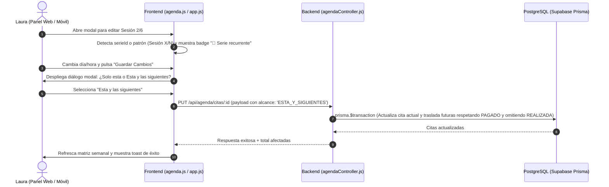

# Plan Técnico 002 — Gestión y Edición de Citas Recurrentes en Serie

## 🏗️ Arquitectura y Módulos Afectados



---

## 🗄️ Modelo de Datos (Prisma)

### Archivo: `backend/prisma/schema.prisma`
```prisma
model Cita {
  id              Int               @id @default(autoincrement())
  pacienteId      Int
  fechaHora       DateTime
  estado_cita     EstadoCita        @default(PENDIENTE)
  estado_pago     EstadoPago        @default(PENDIENTE)
  categoria       String?
  color           String            @default("#3EB8CC")
  monto           Float             @default(500)
  serieId         String?           // Identificador único de grupo para citas recurrentes
  createdAt       DateTime          @default(now())
  updatedAt       DateTime          @updatedAt

  paciente        Paciente          @relation(fields: [pacienteId], references: [id], onDelete: Cascade)
  notificaciones  LogNotificacion[]

  @@index([pacienteId])
  @@index([fechaHora])
  @@index([serieId])
}
```

---

## 🔌 Contratos de API

### 1. Creación de Citas Recurrentes (`POST /api/agenda/citas`)
- **Comportamiento**: Si `repeticiones > 1`, se genera un `serieId = "serie_" + Date.now() + "_" + nanoid` y se asigna idéntico a todas las citas creadas en el bucle.

### 2. Edición de Cita (`PUT /api/agenda/citas/:id`)
- **Query / Body**: `{ ..., alcance: 'SOLO_ESTA' | 'ESTA_Y_SIGUIENTES' }`
- **Lógica `ESTA_Y_SIGUIENTES`**:
  1. Obtiene la cita base y calcula el `deltaMs = nuevaFechaHora - fechaHoraOriginal`.
  2. Busca citas futuras de la serie (`serieId` o fallback por paciente y regex `(Sesión \d+/\d+)`) con `fechaHora >= fechaHoraOriginal`, `id != idActual` y `estado_cita != 'CANCELADA'`.
  3. Ejecuta transacción atómica:
     - Actualiza la cita actual.
     - Para cada cita futura:
       - Si `estado_cita === 'REALIZADA'` -> Omite cambio de fecha/hora (protección clínica).
       - Si `estado_cita !== 'REALIZADA'` -> `nuevaFecha = fechaOriginal + deltaMs`.
       - Si `estado_pago === 'PAGADO'` -> Preserva `PAGADO`.
       - Si `monto` se especificó y la cita no está pagada -> Actualiza `monto`.
       - Actualiza `color`, notas y enlace de Zoom.

### 3. Cancelación / Eliminación en Serie (`PATCH /api/agenda/citas/:id/cancelar` y `DELETE /api/agenda/citas/:id`)
- **Query / Body**: `{ alcance: 'SOLO_ESTA' | 'ESTA_Y_SIGUIENTES' }`
- **Lógica**: Cancela o elimina la cita actual y todas las citas futuras de esa serie dentro de una transacción `prisma.$transaction`.

---

## ⚖️ Decisiones Técnicas Justificadas

| Decisión | Alternativa Descartada | Motivo |
|---|---|---|
| **Campo `serieId` en `Cita` + Fallback regex** | Solo buscar por paciente y fecha | Vinculación explícita e inequívoca de citas de la misma serie, con fallback hacia atrás para no romper citas creadas antes de esta feature. |
| **Cálculo por desplazamiento `deltaMs`** | Recalcular fechas desde cero con frecuencia | Preserva excepciones que Laura haya ajustado manualmente en semanas intermedias sin sobreescribirlas a ciegas. |
| **Protección estricta de citas `REALIZADA`** | Mover todas las citas sin importar estado | Innegociable ético-clínico: no alterar retrospectivamente fechas de sesiones ya ejecutadas. |
| **Diálogo modal elegante con botones touch** | Confirmación estándar `window.confirm()` del navegador | La alerta nativa del navegador es tosca, no personalizable y ofrece mala experiencia en móviles. |

---

## 🧪 Estrategia de Pruebas
- **Script automatizado backend**: `backend/scripts/testCitasRecurrentes.js` validando creación con `serieId`, actualización `SOLO_ESTA`, propagación `ESTA_Y_SIGUIENTES` y preservación de `PAGADO`/`REALIZADA`.
- **Pruebas manuales GUI**: Validación en desktop y simulación móvil en `@media (max-width: 900px)`.
