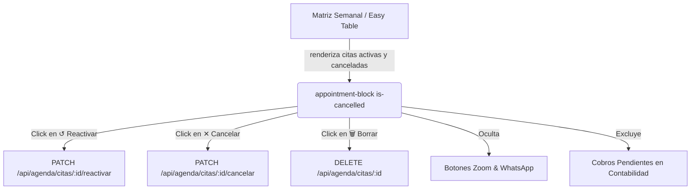

# Plan Técnico — Spec 003: Estado Visual y Visibilidad de Citas Canceladas en Matriz Semanal

## 🏗️ Arquitectura y Componentes Afectados

---

## 🛠️ Plan de Cambios por Capa

### 1. Frontend: Estilos y Renderizado Visual (`panel/panel.css`, `panel/js/agenda.js`)
- **Estilos en `panel/panel.css`**:
  - `.appointment-block.is-cancelled`:
    - Opacidad calibrada `opacity: 0.72; filter: grayscale(25%);`
    - Borde izquierdo distintivo en rojo coral / carmesí (`border-left: 4px solid #ef4444;`).
    - Patrón o fondo atenuado respetando el color del paciente.
  - `.patient-name.is-cancelled`:
    - `text-decoration: line-through; color: rgba(255,255,255,0.85);`
  - `.badge-cancelada`:
    - Fondo blanco sólido con texto rojo: `background: #ffffff; color: #dc2626; font-weight: 700; border-radius: 4px; padding: 1px 6px; box-shadow: 0 1px 3px rgba(0,0,0,0.15); font-size: 0.72rem;`.
  - `.btn-cancel-quick`:
    - Botón de cancelación rápida en la cápsula superior con icono `fa-solid fa-xmark` o `fa-ban`.
  - `.btn-reactivar-quick`:
    - Botón de reactivación con icono `fa-solid fa-rotate-left`.

- **Lógica en `panel/js/agenda.js`**:
  - Actualizar `renderTable()`:
    - Incluir citas con `estado_cita === 'CANCELADA'` en la matriz semanal.
    - Condicionar el renderizado de la tarjeta:
      - Si `cita.estado_cita === 'CANCELADA'`:
        - Aplicar clase `is-cancelled`.
        - Renderizar distintivo `badge-cancelada`.
        - En cápsula superior: mostrar botón `btn-reactivar-quick` (`↺ Reactivar`).
        - En barra inferior: ocultar Zoom y WhatsApp; conservar Editar y Borrar.
      - Si la cita está activa:
        - Añadir en la cápsula superior o barra de acciones el botón rápido de cancelación `[ ✕ ]` que llama a `toggleCancelarCita(id, event)`.
  - Implementar funciones auxiliares:
    - `window.toggleCancelarCita(id, event)`: cambia estado a `CANCELADA` con sonido de retroalimentación acústica.
    - `window.toggleReactivarCita(id, event)`: cambia estado a `PENDIENTE` y restaura controles normales.

### 2. Frontend: Modal de Edición (`panel/agenda.html`, `panel/js/app.js`)
- Añadir selector interactivo de estado de cita en el modal de edición (`#seccionEstadoCita`):
  - `[ ⏳ Pendiente ]`
  - `[ ✓ Realizada ]`
  - `[ ✕ Cancelada ]`
- Al guardar edición, enviar `estado_cita` seleccionado en el payload de actualización `PUT /api/agenda/citas/:id`.

### 3. Backend: Endpoints y Controladores (`backend/src/controllers/agendaController.js`)
- Asegurar que `PUT /api/agenda/citas/:id` acepte `estado_cita: z.enum(['PENDIENTE', 'CONFIRMADA', 'REALIZADA', 'CANCELADA']).optional()`.
- Verificar que el endpoint `PATCH /api/agenda/citas/:id/reactivar` y `PATCH /api/agenda/citas/:id/cancelar` operen de forma atómica y respondan con el estado actualizado.

### 4. Contabilidad y Reportes (`panel/js/pagos.js`)
- Verificar que los reportes contables (`calcularReporteMensual`, `renderAuditoriaSemanal`) excluyan citas `CANCELADA` de las cuentas por cobrar (ya contemplado) y permitan conservar pagos si `estado_pago === 'PAGADO'`.

---

## 🧪 Plan de Pruebas y Verificación
1. **Prueba automatizada**: Crear `backend/scripts/testVisibilidadCanceladas.js` para validar ciclo de vida: creación -> cancelación rápida -> consulta semanal -> reactivación -> reporte contable.
2. **Prueba visual**:
   - Marcar una cita como `✕ Cancelada` desde la tarjeta: la tarjeta se atenúa, muestra `✕ Cancelada`, oculta WhatsApp/Zoom y muestra `↺ Reactivar`.
   - Pulsar `↺ Reactivar`: la tarjeta vuelve al estado activo normal al instante.
   - Verificar que no genera saldos por cobrar en el reporte contable.
   - Verificar que sigue apareciendo en el buscador global.
