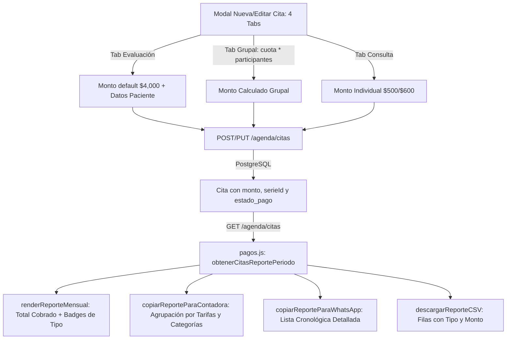

# Plan Técnico — Spec 004: Gestión de Costos en Terapia Grupal, Evaluaciones y Desglose Contable Mensual por Tarifas

> **Objetivo**: Implementar las 4 pestañas de registro (`Consulta`, `Evaluación`, `Terapia Grupal`, `Bloquear Horario`), la calculadora de tarifas grupales, la inclusión financiera en el motor de reportes y el generador de desglose agrupado para la contadora en WhatsApp y CSV.

---

## 🏛️ 1. Arquitectura y Componentes Afectados

---

## 🛠️ 2. Cambios Específicos por Archivo

### A) Frontend — Modal y Formulario (`panel/agenda.html` y `panel/js/agenda.js`)
1. **`panel/agenda.html`**:
   - En `#seccionTabsTipo`, agregar la pestaña `tabTipoEvaluacion` (`[ 🧠 Evaluación ]`).
   - En `#seccionMontoSesion`, añadir el sub-bloque `#calculadoraGrupal` con inputs:
     - `#nc_cuota_persona` (Cuota por persona, ej. $150 MXN).
     - `#nc_num_participantes` (Número de participantes, ej. 6).
   - En `#modalReporteMensual`, agregar el botón `[ 📋 Copiar para Contadora ]`.
2. **`panel/js/agenda.js`**:
   - En `seleccionarTipoRegistro(tipo)`:
     - Si `tipo === 'EVALUACION'`: Mostrar campos de paciente, zoom, fecha/hora y `#seccionMontoSesion` con valor predeterminado `$4,000` (editable), color índigo/azul (`#6366f1`) y placeholder de nombre adaptado.
     - Si `tipo === 'GRUPAL'`: Mostrar `#seccionMontoSesion` y `#calculadoraGrupal`, ocultar campos de contacto y calcular `#nc_monto = cuota * participantes`.
     - Si `tipo === 'BLOQUEO'`: Mantener monto `$0` y ocultar campos innecesarios.
     - Si `tipo === 'CITA'`: Mantener flujo estándar de consulta individual.
   - En `editarCita(id)`:
     - Detectar si es `EVALUACION`, `GRUPAL`, `BLOQUEO` o `CITA`, cargar su monto real y permitir modificarlo junto a su estado de pago.

### B) Frontend — Manejador de Envío (`panel/js/app.js`)
1. **`panel/js/app.js`**:
   - En el listener `submit` de `#formNuevaCita`:
     - Manejar `tipoEfectivo === 'EVALUACION'` asignando `[EVALUACION]` a la categoría y preservando su monto (ej. `$4,000`).
     - Manejar `tipoEfectivo === 'GRUPAL'` asignando `[GRUPAL]` y preservando su monto calculado.
     - Remover el forzado a `0` para grupales y evaluaciones.

### C) Frontend — Motor Contable y Exportadores (`panel/js/pagos.js`)
1. **`obtenerCitasReportePeriodo()`**:
   - Incluir citas grupales (`[GRUPAL]`) y evaluaciones (`[EVALUACION]`) en la lista de citas del periodo (mantener solo `[BLOQUEO]` excluido).
2. **`renderReporteMensual()`**:
   - Las citas individuales, evaluaciones y grupales pagadas suman a `totalCobrado`.
   - En la tabla de sesiones, mostrar badges distintivos: `[Individual]`, `[Evaluación]` y `[Grupal]`.
3. **`copiarReporteParaContadora()` (Nuevo Botón y Algoritmo)**:
   - Recorrer todas las citas pagadas del mes:
     - Agrupar consultas individuales por tarifa: `• 20 sesiones individuales de $600 = $12,000.00` / `• 5 de $500 = $2,500.00`.
     - Agrupar terapias grupales: `• 2 sesiones grupales = $4,000.00 total`.
     - Agrupar evaluaciones: `• 1 evaluación de $4,000 = $4,000.00`.
     - Contar sesiones de cortesía ($0): `• 9 sesiones gratuitas`.
   - Totalizar: `💰 Ingresos totales: $22,500.00 MXN`.
4. **`copiarReporteParaWhatsApp()`**:
   - Mantener el formato cronológico detallado línea por línea con fecha, hora, nombre, monto y estatus de pago.
5. **`descargarReporteCSV()`**:
   - Exportar con columna de tipo (`Individual`, `Evaluación`, `Grupal`) y monto correspondiente.

---

## ⚖️ 3. Decisiones Técnicas con Alternativas Descartadas

| Decisión Técnica | Alternativa Descartada | Motivo del Descarte |
|---|---|---|
| **D1: Cuarta pestaña explícita `[ 🧠 Evaluación ]` con tarifa predeterminada de $4,000 editable.** | Depender de que Laura escriba a mano la palabra "evaluación" en las notas de cada cita. | Mayor seguridad operativa; con 1 clic selecciona el tipo, se autocompleta el precio de $4,000 y queda 100% clasificada sin margen de error humano. |
| **D2: Mini-calculadora integrada en el formulario grupal (`cuota × integrantes = total`) con edición libre del total.** | Crear una tabla secundaria de "participantes por grupo" con nombres y pagos individuales. | Demasiado complejo y lento para el flujo ágil de Laura en consulta; Laura solo necesita saber el total recaudado del grupo para cuadrar el mes. |
| **D3: Dos botones de copia separados en el reporte mensual (`[ 📋 Copiar para Contadora ]` y `[ 💬 Copiar Detallado WhatsApp ]`).** | Reemplazar completamente el botón de WhatsApp existente por el formato de la contadora. | Laura en ocasiones necesita el desglose detallado día por día con nombres de pacientes para su propio archivo personal; tener dos botones claros da máxima flexibilidad. |

---

## 🧪 4. Plan de Verificación Automatizada

Crear [`backend/scripts/testReporteContadoraDesglose.js`](file:///c:/Users/crist/Documents/Proyectos/Web%20PsicoLau/backend/scripts/testReporteContadoraDesglose.js) que:
1. Cree el dataset exacto de Laura con las 37 citas reales:
   - 20 sesiones individuales de $600 = $12,000
   - 5 sesiones individuales de $500 = $2,500
   - 2 sesiones grupales de $2,000 c/u = $4,000
   - 1 evaluación de $4,000 = $4,000
   - 9 sesiones de cortesía ($0)
2. Verifique que los ingresos totales sumen exactamente `$22,500.00 MXN`.
3. Verifique que el texto generado para WhatsApp coincida con el desglose exacto de la contadora.
4. Limpie los datos al terminar.
