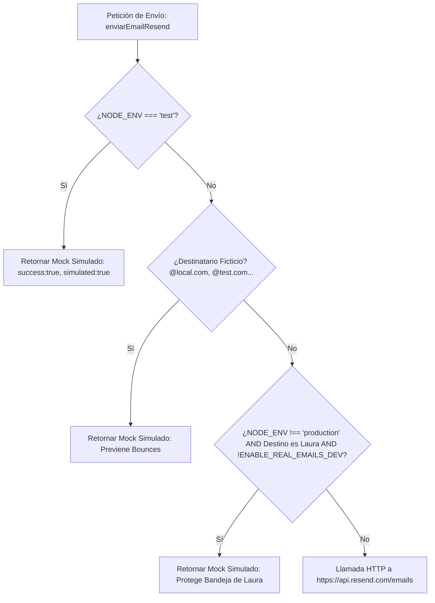

# Plan Técnico: Aislamiento de Correos en Entornos de Pruebas y Desarrollo (Spec 016)

## Arquitectura de la Solución

Se implementará una arquitectura de defensa en profundidad con 3 barreras concéntricas:

---

## Archivos a Modificar / Crear

### 1. [MODIFY] `backend/src/services/emailService.js`
- Agregar helper `esDominioFicticio(email)` para evaluar patrones de prueba:
  - `@(local\.com|test\.com|example\.com|fake\.com|invalid)$`
  - `\.local$`
  - `sin-email-`
- En `enviarEmailResend()`, verificar:
  1. Si `process.env.NODE_ENV === 'test'`: registrar log `[Resend Mock] Simulación en modo TEST` y retornar respuesta simulada exitosa.
  2. Si `esDominioFicticio`: registrar log `[Resend Mock] Omitiendo envío a dominio ficticio: ...` y retornar respuesta simulada.
  3. Si `process.env.NODE_ENV !== 'production'` y el destinatario incluye `CORREO_DESTINO` y `process.env.ENABLE_REAL_EMAILS_DEV !== 'true'`: registrar log `[Resend Mock] Notificación a Laura silenciada en desarrollo local` y retornar respuesta simulada.

### 2. [MODIFY] `backend/scripts/runTests.js`
- En `startEphemeralServer()`: inyectar `NODE_ENV: 'test'` en el objeto `env` de `spawn`.
- En `main()`: inyectar `NODE_ENV: 'test'` en el comando del test runner (`node --test`).

### 3. [NEW] `backend/scripts/testAislamientoEmail.js`
- Suite de pruebas con `node:test` y `node:assert`:
  1. Verificar que con `NODE_ENV=test`, `enviarConfirmacionPaciente` devuelve `simulated: true`.
  2. Verificar que un correo a `usuario@test.com` o `test@local.com` devuelve `simulated: true` aun con `NODE_ENV=development`.
  3. Verificar que un aviso a Laura devuelve `simulated: true` en desarrollo local sin variable de override.
  4. Ejecución en transacción o con limpieza segura.

---

## Plan de Verificación
1. Ejecutar `node backend/scripts/testAislamientoEmail.js`.
2. Ejecutar `backend/scripts/testBlindajeEntradas.js` y comprobar que `POST /api/citas/public` crea la cita del paciente de prueba sin llamar a Resend.
3. Ejecutar la suite completa `npm test` en `backend/` asegurando 100% PASS (ahora 28 tests).
4. Confirmar que ninguna nueva petición aparezca en el panel de Resend tras correr los tests.
