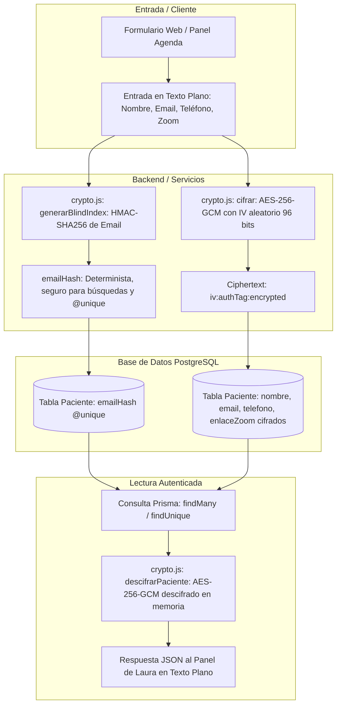

# Plan Técnico: Cifrado Integral de Datos Personales Identificables (PII) de Pacientes (Spec 017)

## 1. Arquitectura Técnica de Cifrado y Búsqueda Ciega (Blind Indexing)



---

## 2. Archivos Afectados y Modificaciones

### 1. [MODIFY] `backend/prisma/schema.prisma`
- Actualizar el modelo `Paciente`:
  ```prisma
  model Paciente {
    id            Int          @id @default(autoincrement())
    nombre        String       // Cifrado con AES-256-GCM
    telefono      String       // Cifrado con AES-256-GCM
    email         String       // Cifrado con AES-256-GCM
    emailHash     String?      @unique // Blind index HMAC-SHA256 para unicidad y búsqueda exacta O(1)
    enlaceZoom    String?      // Cifrado con AES-256-GCM
    tarifaDefecto Float?       @default(500)
    citas         Cita[]
    expedientes   Expediente[]
    createdAt     DateTime     @default(now())
    updatedAt     DateTime     @updatedAt

    @@index([emailHash])
  }
  ```
- Ejecutar `npx prisma db push` y `npx prisma generate` en el entorno de desarrollo.

### 2. [MODIFY] `backend/src/utils/crypto.js`
- Añadir helpers especializados para PII:
  - `generarBlindIndex(texto)`: Calcula `HMAC-SHA256(texto.toLowerCase().trim(), ENCRYPTION_KEY)` en formato hexadecimal.
  - `cifrarPaciente(datos)`: Cifra `nombre`, `telefono`, `email`, `enlaceZoom` y calcula `emailHash`.
  - `descifrarPaciente(paciente)`: Descifra transparentemente los 4 campos si presentan el formato `iv:tag:ciphertext`.
  - `esCifrado(texto)`: Comprueba si una cadena cumple la estructura `^[0-9a-f]{24}:[0-9a-f]{32}:[0-9a-f]+$`.

### 3. [MODIFY] `backend/src/utils/agendaHelpers.js`
- Adaptar `buscarOCrearPacienteParaCita` y `validarEmailUnicoPaciente`:
  - Para buscar por correo electrónico: usar `where: { emailHash: generarBlindIndex(email) }`.
  - Para pacientes en memoria: descifrar el paciente encontrado antes de retornar.

### 4. [MODIFY] `backend/src/controllers/agendaController.js`
- En `obtenerCitas`: Descifrar `cita.paciente` antes de emitir la respuesta.
- En creación/edición de citas: Cifrar los datos de paciente al crear o actualizar.

### 5. [MODIFY] `backend/src/controllers/citaController.js`
- En `crearCitaPublica`:
  - Buscar por `emailHash` en lugar de búsqueda por texto plano.
  - Almacenar los datos del paciente cifrados mediante `cifrarPaciente`.

### 6. [MODIFY] `backend/src/controllers/expedienteController.js`
- En `obtenerExpedientePaciente` y búsqueda en directorio: descifrar los datos de `paciente` para que el directorio de expedientes muestre los nombres y teléfonos de forma normal a Laura.

### 7. [NEW] `backend/scripts/migrateEncryptPacientes.js`
- Script de migración atómica y reversible para convertir los 10 pacientes existentes de la base de datos dev al formato cifrado con sus respectivos `emailHash`.

### 8. [NEW] `backend/scripts/testCifradoPacientes.js`
- Suite de pruebas automatizadas con `node:test` verificando:
  1. Que la base de datos almacena formato `iv:tag:ciphertext` en `nombre`, `telefono`, `email` y `enlaceZoom`.
  2. Que `emailHash` se genera y permite búsquedas directas.
  3. Que las llamadas a la API retornan datos descifrados legibles solo para clientes autenticados.
  4. Limpieza segura y garantía constitucional.

---

## 3. Decisiones Técnicas y Alternativas Descartadas

| Decisión Técnica | Alternativa Descartada | Motivo de la Elección |
| :--- | :--- | :--- |
| **AES-256-GCM + Blind Index (HMAC-SHA256)** | Cifrado determinista ECB/CBC sin sal | El cifrado determinista es vulnerable a ataques de análisis de frecuencia y comparación de diccionarios. AES-GCM ofrece cifrado autenticado militar con integridad (evita manipulación de bits). El blind index HMAC-SHA256 permite búsquedas exactas y unicidad sin comprometer la confidencialidad. |
| **Descifrado en capa de controladores Node.js** | Extensiones PostgreSQL `pgcrypto` en Supabase | Mantener el cifrado y descifrado en Node.js garantiza arquitectura **Zero-Knowledge** respecto a Supabase: la clave de cifrado nunca toca el servidor de base de datos ni los logs de PostgreSQL. |
| **Búsqueda en memoria para autocompletado** | Trigram / Fuzzy Search sobre texto cifrado | El volumen de pacientes de un consultorio privado clínico es de cientos, no millones de registros. Descifrar en memoria al cargar la vista de agenda es instantáneo (<5 ms) y mantiene la búsqueda flexible en el cliente (`filter()`) sin exponer índices de texto en la base de datos. |

---

## 4. Plan de Verificación
1. Ejecutar migración de pacientes con `migrateEncryptPacientes.js`.
2. Inspeccionar la base de datos de desarrollo con `inspectDb.js` para certificar que ni un solo nombre, teléfono o correo queda en texto plano.
3. Ejecutar la nueva suite de tests `testCifradoPacientes.js`.
4. Ejecutar la suite completa unificada `npm test` asegurando 100% PASS sin regresiones.
